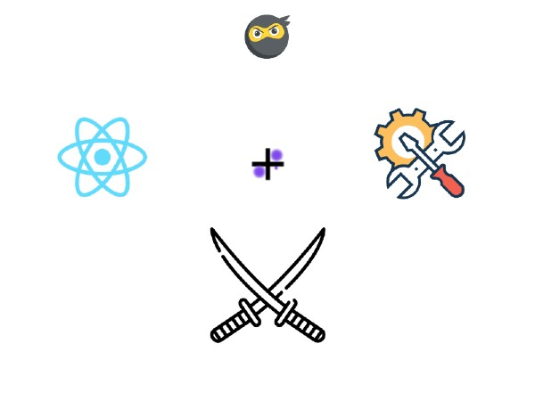

# REACT DEV TOOLS

</img>

# sudo bash install.sh ---> Install the tools
don't worry, no backdoor...

synthax : react-ninjamer-tools <option> <option> <element_name> [<element_name>]"
	
Attention : Make sure you are in your root folder and you do not have unsaved code a file you want to touch with the tool !"
	
 ------------------------------------------- Options : 
	
```bash
 --init ----------> without any other parameter to init ninjamer-tools in your project ! It comes with react-redux structure"
```
```bash
 -c ----------> generate a component."
```
```bash	
 -r ----------> generate a reducer."
```
```bash	
 -p ----------> generate a page."
```	
```bash	
 -const ----------> generate a constant file" 
```
```bash	
 -a ----------> generate an actions file 
```
```bash
 -i ----------> import component in a page.[... -i component_name page_name]" 
```bash
	
 Note: for speed & fast developement while using redux, please give same name to {constant, action & reducer} file

# Have a good time hacking my ninja !

